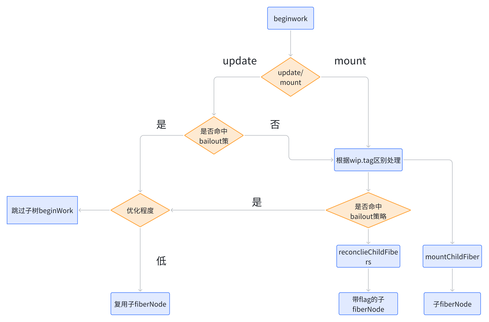
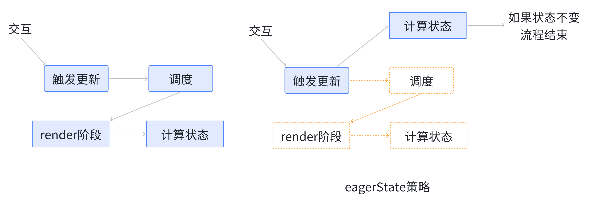
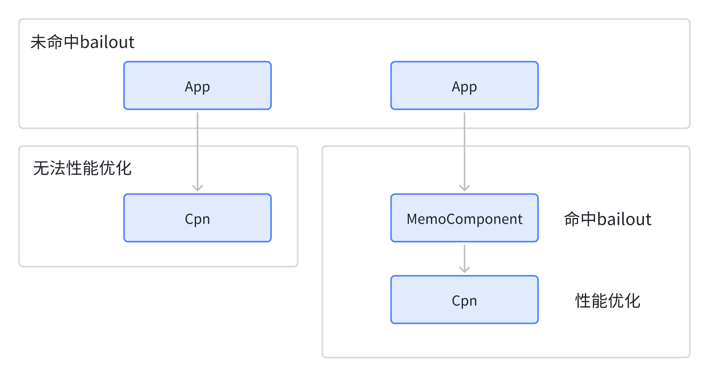

# mini-react 开发文档

## 1.实现 JSX

实现 ReactElement 方法：react/src/jsx.ts

实现 JSX 的打包

三种打包 React，jsx-runtime，jsx-dev-runtime

调试方式
cd dist/node_modules/react
pnpm link --global
新建 react 项目

pnpm link react --global

## 2.Reconciler 实现

react workLoop

jsx -> ReactElement -> fiberNode -> Dom Element

## 3.状态更新机制

FiberRootNode 和 HostRootFiber

mount 和 upadte

## 4.实现 mount

beginwork 和 updatework

beginWord 从上往下递，传入 `当前Fiber节点`，创建 `子Fiber节点`
completeWork 从下往上归，向上回溯处理兄弟节点和父节点，完成副作用收集，例如生成 subtreeFlags

## 5.实现 commitWork

根据 beginWork 和 updateWork 得到的 finishedWork 节点
FiberRootNode 上的 finishedWork 开始 commit

根据 fiber 节点上的 subtreeFlags 和 fiags 找到实际要操作的 dom 节点，插入到相应的父 dom 节点中,

实现 react-dom 主要实现浏览器环境下的 hostConfig，调用 react-conciler 中的 createContainer 方法创建 hostRootFiber 和 FiberRootNode 实现 ReactDOM.createRoot

调用 react-conciler 中的 updateContainer 实现 ReactDOM.createRoot.render

## 5.实现 FC

beginWork 和 completeWork 添加对 FunctionComponment 的处理
FunctionComponment 的 child 即 render 方法 保存在 FiberNode.type 中

## 6.实现 mount 时的 useState

根据 mount update 或 state 上下文调用不同的 state，react 包中定义数据中间层并在 shared 包中同步一份，reconciler 中引用 shared 包中的数据中间层 internals

数据结构 Dispatcher \react\src\currentDispatcher.ts

react 包暴露 useState，返回的是当前环境（mount update 或 state 上下文）currentDispatcher.current 的 useState

具体实现 react-reconciler\src\fiberHooks.ts

定义 Hook 节点数据结构，HookDispatcherOnMount，MountState

## 7.使用 react 官方的测试用例

安装 jest 等相关依赖，react/src/**tests**/存放测试用例

## 8.update 时的 useState

- 处理 render 阶段的 beginwork 和 completework
- 处理 commit 阶段

## 9.实现事件系统

react-dom/src/SyntheticEvent.ts

**事件注册（\*\***initEvent\***\*）**：只在根节点（`container`）上注册一次事件监听器。

**事件分发（\*\***dispatchEvent\***\*）**：统一处理事件并模拟冒泡/捕获。

**事件路径收集（\*\***collectPaths\***\*）**：根据真实 DOM 结构从事件 target 向上回溯到 container，收集每层上的事件处理函数。

**合成事件构造（\*\***createSyntheticEvent\***\*）**：为事件添加自定义的 `stopPropagation` 行为，模拟 React 的合成事件。

**事件分发流程（\*\***tagglerEventFlow\***\*）**：依次执行收集的捕获/冒泡事件处理函数。

合成事件对象 se

## 10.实现多节点 diff

reconciler 阶段支持多节点的 diff

## 11.实现 Fragment

## 12.实现同步调度

feat: 实现基于 Lane 的优先级调度机制

添加 Lane 模型来管理更新优先级，支持同步任务微任务调度

引入 fiberLanes 模块定义 Lane 类型和操作函数

重构 updateQueue 以支持基于 Lane 的更新处理

实现 scheduleSyncCallback 进行同步任务调度

- packages\react-dom\src\hostConfig.ts

添加微任务处理方法

- packages\react-reconciler\src\beginWork.ts

修改 beginWork，在 hostRoot 和函数组件更新时添加 renderLane 相关调度，

修改 renderWithHooks

- FiberRootNode 中添加 pendingLanes（待处理的 Lanes）和 finishedLane（当前处理的 Lane）
- 修改 updateQueue 为链表结构

workLoop.ts

// render1 render2 render3

scheduleSyncCallback(performSyncWorkOnRoot.bind(null, root, updateLane));

// 同步任务 微任务调度

scheduleMictask(flushSyncCallbacks);

## 13.实现 useEffect

react/index.ts react/src/currentDispatcher.ts 添加 useEffect 相关 interface

## 14.测试 useEffect

Child mount

Parent mount

App mounted

Parent unmount

Child unmount

挂载时自上而下收集依赖，React 首先渲染组件树（App → Parent → Child），然后自底向上执行所有 useEffect

React 执行顺序：

**同步渲染阶段：**

这个过程是 **“构建虚拟 DOM 树”**，不会触发 `useEffect`

**提交 DOM 到真实页面之后，开始执行所有 \*\***useEffect\***\*（异步）：**

组件卸载时 自上而下执行副作用

## 15.同步更新和并发更新

update 阶段可中断 updateState 方法

新增 baseState、baseQueue 字段:

- baseState 是本次更新参与计算的初始 state，memoizedState 是上次更新计算的最终 state
- 如果本次更新没有 update 被跳过，则下次更新开始时 baseState === memoizedState
- 如果本次更新有 update 被跳过，则本次更新计算出的 memoizedState 为「考虑优先级」情况下计算的结果，baseState 为「最后一个没被跳过的 update 计算后的结果」，下次更新开始时 baseState！==memoizedState
- 本次更新「被跳过的 update 及其后面的所有 update」都会被保存在 baseQueue 中参与下次 state 计算
- 本次更新「参与计算但保存在 baseQueue 中的 update」，优先级会降低到 NoLane

```javascript
u1;
{
	action: (num) => num + 1;
	lane: DefaultLane;
}
u2;
{
	action: 3;
	lane: Synclane;
}
u3;
{
	action: (num) => num + 3;
	lane: DefaultLane;
}
```

第一次 render
baseState = 0; memorizedState = 0;
baseQueue = null; updateLane = DefaultLane;

第一次 render 第一次计算
baseState = 0; memorizedState = 1;
baseQueue = null;

第一次 render 第二次计算(u2 被跳过)
baseState = 1; memorizedState = 1;
baseQueue = u2;
第一次 render 第三次计算
baseState = 1; memorizedState = 11;
baseQueue = u2 -> u3(NoLane);

第二次 render
baseState = 1; memorizedState = 11;
baseQueue = u2 -> u3(NoLane); updateLane = Synclane;
第二次 render 第一次计算
baseState = 3; memorizedState = 3;
第二次 render 第二次计算
baseState = 13; memorizedState = 13;

调度时选择当前优先级最高的

## 16.实现 useTransition

1. 标记非紧急更新为"过渡"状态

   - 将某些状态更新标记为可中断的过渡(transition)
   - React 会优先处理更紧急的更新

2. 提供加载状态指示

   - 返回一个 `isPending` 标志，表示过渡是否正在进行
   - 可用于显示加载指示器

3. 避免不必要的加载状态闪烁

   - 在快速设备上自动跳过加载状态的显示

核心是在 useTransition 维护 isPending 和一个 hook

```javascript
function mountTransition(): [boolean, (callback: () => null) => void] {
    const [isPending, setIsPending] = mountState(false);
    const hook = mountWorkInProgressHook();
    const start = startTransition.bind(null, setIsPending);
    hook.memoizedState = start;
    return [isPending, start];
}

function updateTransition(): [boolean, (callback: () => null) => void] {
    const [isPending] = updateState();
    const hook = updateWorkInProgressHook();
    const start = hook.memoizedState;
    return [isPending as boolean, start];
}

function startTransition(
    setIsPending: Dispatch<boolean>,
    callback: () => null
) {
    setIsPending(true);
    const prevTransition = currentBatchConfig.transition;
    currentBatchConfig.transition = 1;

    callback();
    setIsPending(false);

    currentBatchConfig.transition = prevTransition;
}
```

## 17.实现 useRef

冷知识，控制台打印的是对象的引用

HostComponent Ref 工作流程

1. 标记 Ref

标记 Ref 需要满足：

- mount 时：存在 ref
- update 时：ref 引用变化

标记的时机包括：

- beginWork

```javascript
function markRef(current: FiberNode | null, workInProgress: FiberNode) {
	const ref = workInProgress.ref;
	if (
		(current === null && ref !== null) || // mount
		(current !== null && current.ref !== ref) // update
	) {
		workInProgress.flags |= Ref;
	}
}
```

- completeWork

```javascript
function markRef(fiber: FiberNode) {
	fiber.flags |= Ref;
}
```

1. 执行 Ref 操作

包括两类操作：

```javascript
// 绑定ref
function safelyAttachRef(fiber: FiberNode) {
	const ref = fiber.ref;
	if (ref !== null) {
		const instance = fiber.stateNode;
		if (typeof ref === 'function') {
			ref(instance);
		} else {
			ref.current = instance;
		}
	}
}
// 解绑ref
function safelyDetachRef(current: FiberNode) {
	const ref = current.ref;
	if (ref !== null) {
		if (typeof ref === 'function') {
			ref(null);
		} else {
			ref.current = null;
		}
	}
}
```

## 18.实现 useContext

核心是不同 Provide 的嵌套及返回

```typescript
import { ReactContext } from 'shared/ReactTypes';

let prevContextValue: any = null;
const prevContextValueStack: any[] = [];

export function pushProvider<T>(context: ReactContext<T>, newValue: T) {
	prevContextValueStack.push(prevContextValue);
	prevContextValue = context._currentValue;
	context._currentValue = newValue;
}

export function popProvider<T>(context: ReactContext<T>) {
	context._currentValue = prevContextValue;

	prevContextValue = prevContextValueStack.pop();
}
```

beginWork 时调用 pushProvider

completeWork 时调用 popProvider

## 19.Suspense

### Suepense 架构

- mount 时正常流程

```javascript
function mountSuspensePrimaryChildren(wip: FiberNode, primaryChildren: any) {
	const primaryChildProps: OffscreenProps = {
		mode: 'visible',
		children: primaryChildren
	};

	const primaryChildFragment = createFiberFromOffscreen(primaryChildProps);
	wip.child = primaryChildFragment;
	primaryChildFragment.return = wip;
	return primaryChildFragment;
}
```

- mount 时挂起流程

```javascript
function mountSuspenseFallbackChildren(
	wip: FiberNode,
	primaryChildren: any,
	fallbackChildren: any
) {
	const primaryChildProps: OffscreenProps = {
		mode: 'hidden',
		children: primaryChildren
	};

	const primaryChildFragment = createFiberFromOffscreen(primaryChildProps);
	const fallbackChildFragment = createFiberFromFragment(fallbackChildren, null);

	fallbackChildFragment.flags |= Placement;

	primaryChildFragment.return = wip;
	fallbackChildFragment.return = wip;
	primaryChildFragment.sibling = fallbackChildFragment;
	wip.child = primaryChildFragment;

	return fallbackChildFragment;
}
```

- update 时正常流程

```javascript
function updateSuspensePrimaryChildren(wip: FiberNode, primaryChildren: any) {
    const current = wip.alternate as FiberNode;
    const currentPrimaryChildFragment = current.child as FiberNode;
    const currentFallbackChildFragment: FiberNode | null =
        currentPrimaryChildFragment.sibling;

    const primaryChildProps: OffscreenProps = {
        mode: 'visible',
        children: primaryChildren
    };

    const primaryChildFragment = createWorkInProgress(
        currentPrimaryChildFragment,
        primaryChildProps
    );
    primaryChildFragment.return = wip;
    primaryChildFragment.sibling = null;
    wip.child = primaryChildFragment;

    if (currentFallbackChildFragment !== null) {
        const deletions = wip.deletions;
        if (deletions === null) {
            wip.deletions = [currentFallbackChildFragment];
            wip.flags |= ChildDeletion;
        } else {
            deletions.push(currentFallbackChildFragment);
        }
    }
    return primaryChildFragment;
}
```

- update 时挂起流程

```cpp
function updateSuspenseFallbackChildren(
    wip: FiberNode,
    primaryChildren: any,
    fallbackChildren: any
) {
    const current = wip.alternate as FiberNode;
    const currentPrimaryChildFragment = current.child as FiberNode;
    const currentFallbackChildFragment: FiberNode | null =
        currentPrimaryChildFragment.sibling;

    const primaryChildProps: OffscreenProps = {
        mode: 'hidden',
        children: primaryChildren
    };

    const primaryChildFragment = createWorkInProgress(
        currentPrimaryChildFragment,
        primaryChildProps
    );
    let fallbackChildFragment;
    if (currentFallbackChildFragment) {
        fallbackChildFragment = createWorkInProgress(
            currentFallbackChildFragment,
            fallbackChildren
        );
    } else {
        fallbackChildFragment = createFiberFromFragment(fallbackChildren, null);
        fallbackChildFragment.flags |= Placement;
    }

    fallbackChildFragment.return = wip;
    primaryChildFragment.return = wip;
    primaryChildFragment.sibling = fallbackChildFragment;
    wip.child = primaryChildFragment;

    return fallbackChildFragment;
}
```

### Suepense 工作流程

1. beginWork 时进入上述任一阶段
2. completeWork 时对比 current Offscreen Mode 与 Wip Offscreen Mode，如果发现下述情况，则标记 Visibility effectTag

- mode 从 hidden 变为 visible
- mode 从 visible 变为 hidden
- current === null && hidden

1. commitWork 处理 Visibility effectTag

处理 Visibility effectTag 时需要找到所有子树顶层 Host 节点：

```javascript
function hideOrUnhideAllChildren(finishedWork: FiberNode, isHidden: boolean) {
	findHostSubtreeRoot(finishedWork, (hostRoot) => {
		const instance = hostRoot.stateNode;
		if (hostRoot.tag === HostComponent) {
			isHidden ? hideInstance(instance) : unhideInstance(instance);
		} else if (hostRoot.tag === HostText) {
			isHidden
				? hideTextInstance(instance)
				: unhideTextInstance(instance, hostRoot.memoizedProps.content);
		}
	});
}

// 找到子树顶层host节点
function findHostSubtreeRoot(
	finishedWork: FiberNode,
	callback: (hostSubtreeRoot: FiberNode) => void
) {
	let node = finishedWork;
	let hostSubtreeRoot = null;
	while (true) {
		// TODO 处理逻辑
		if (node.tag === HostComponent) {
			if (hostSubtreeRoot === null) {
				hostSubtreeRoot = node;
				callback(node);
			}
		} else if (node.tag === HostText) {
			if (hostSubtreeRoot === null) {
				callback(node);
			}
		} else if (
			node.tag === OffscreenComponent &&
			node.pendingProps.mode === 'hidden' &&
			node !== finishedWork
		) {
			//Offscreen嵌套
		} else if (node.child !== null) {
			node.child.return = node;
			node = node.child;
			continue;
		}
		//  1. 遇到子节点：往下走（DFS）
		// 如果当前节点有子节点，则进入子节点；
		// 同时将子节点的 return 指向当前节点（即设置“父节点”引用）；
		// 然后继续下一轮循环（继续向下钻）。

		// 2. 当前为叶子节点 且回到根：结束遍历
		// 如果我们回到了根节点，并且它已经没有子节点或兄弟节点了，说明遍历完成，退出。
		if (node === finishedWork) {
			return;
		}

		// 3. 向上回溯，找兄弟节点
		// 如果当前节点没有兄弟节点（说明是其父节点的最后一个子节点），就向上回溯，直到找到一个存在兄弟节点的父节点；
		// 如果回溯到根了（没有父节点或等于 finishedWork），说明整棵树遍历完了，退出。
		while (node.sibling === null) {
			if (node.return === null || node.return === finishedWork) {
				return;
			}

			if (hostSubtreeRoot === node) {
				hostSubtreeRoot = null;
			}

			node = node.return;
		}
		// 4. 找到兄弟节点，转过去继续
		// 找到了兄弟节点，就跳过去，并设置它的 return 为当前节点的父节点。
		if (hostSubtreeRoot === node) {
			hostSubtreeRoot = null;
		}
		node.sibling.return = node.return;
		node = node.sibling;
	}
}
```

### 如何触发 Suspense

1. 正常流程对应 render 阶段
2. 遇到 use，进入挂起流程
3. 进入挂起流程对应 render 阶段
4. 进入挂起流程对应 commit 阶段(渲染 loading)
5. 请求返回后，进入正常流程对应 render 阶段
6. 进入正常流程对应 commit 阶段（渲染 Cpn)

Suspense 涉及到 render 阶段的一个新流程一一 unwind 流程

```javascript
function unWindUnitOfWork(unitOfWork: FiberNode) {
    let incompleteWork: FiberNode | null = unitOfWork;

    do {
        const next = unwindWork(incompleteWork);
        if (next !== null) {
            workInProgress = next;
            return;
        }

        const returnFiber = incompleteWork.return as FiberNode;
        if (returnFiber !== null) {
            returnFiber.deletions == null;
        }
        incompleteWork = returnFiber;
    } while (incompleteWork !== null);

    // 使用了 use, 抛出了 data , 但是没有定义suspense
    wipRootExitStatus = RootDidNotComplete;
    workInProgress = null;
}
```

涉及到 unwind 流程的特性：

- Suspense
- Error Boundary

### 实现 use hook 与 unwind 流程

use 可以接收的数据类型：

- Thenablew
- ReactContext

unwind 流程如何进行到最近的 Suspense?

## 20.React 性能优化

### 性能优化的一般思路

性能优化的一般思路：将「变化的部分」与「不变的部分」分离

什么是「变化的部分」?

- State
- Props
- Context

命中「性能优化」的组件可以不通过 reconcile 生成 wip.child,而是直接复用上次

更新生成的 wip.child。

总结起来有两点：

- 性能优化的思路是将「变化的部分」与「不变的部分」分离
- 命中性能优化的组件的子组件(而不是他本身)不需要 render

1. bailout 策略：减少不必要的子组件 render
2. eagerState 策略：不必要的更新，没必要开启后续调度流程

### bailout 策略

命中「性能优化」(bailout 策略）的组件可以不通过 reconcile 生成 wip.child，而是直接

复用上次更新生成的 wip.child。

bailout 策略存在于 beginWork 中

bailout 四要素:

1. props 不变

比较 props 变化是通过「全等比较」，使用 React.memo 后会变为「浅比较」

1. state 不变

两种情况可能造成 state 不变：

- 不存在 update
- 存在 update，但计算得出的 state 没变化

1. context 不变
2. type 不变

如果 Div 变为 P，返回值肯定变了

为了判断「bailout 四要素」中的「state 不变」，需要判断当前 fiber 是否存在未执行的

update。在 FiberNode 上添加属性 fiber.lanes

作用：保存一个 fiberNode 中「所有未执行更新对应的 lane」

延伸功能：fiber.childLanes，保存一个 fiberNode 子树中「所有未执行更新对应的 lane」

产生:enqueueUpdate

消费:beginWork

未消费时的重置:processUpdateQueue



### eagreState 策略

状态更新前后没有变化，那么没有必要触发更新，为此需要做:

1. 计算更新后的状态
2. 与更新前的状态做比较

通常情况下，「根据 update 计算 state」发生在 beginWork，而我们需要在「触发更新

时」计算状态：

只有满足「当前 fiberNode 没有其他更新」才尝试进入 eagerState 策略。



### 实现 React.memo

demo:performance/memo.tsx

作用：让「props 的全等比较」变为「props 的浅比较」

本质：在子组件与父组件之间增加一个 MemoComponent, MemoComponent 通过「props 的浅比较」命中 bailout 策略



### 实现 useMemo、useCallback

demo: performance/Hook.tsx

demo: performance/useMemo.tsx

useCallback:缓存函数

useMemo:缓存变量（手动 bailout）
